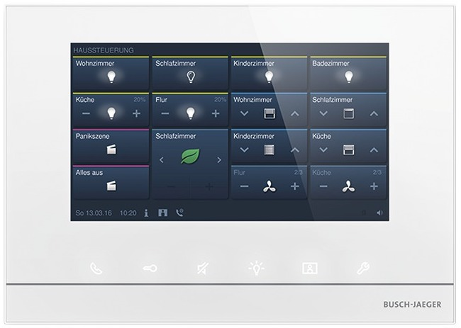

# Busch Jaeger/Free@home Homebridge Plugin

This is a Homebridge plugin for exposing Busch Jaeger/Free@home devices using the required SysAp.

## Features

Here are some of the features of this plugin:

- Expose all of your Busch Jaeger/Free@home devices to HomeKit
- Control your devices using Siri and the Home app
- Configurable MQTT support for integration with other home automation systems
- Automatic reconnection to the SysAp when the connection is lost
- Device and timer configuration options for customized behavior
- Camera support for door calls  (with optional lens correction)

## Configuration

Add the following information to your `config.json` file:

```json

{
  "name": "Free@home",
  "platform": "FreeAtHomePlatform",
  "hostname": "192.168.1.2",
  "username": "username",
  "password": "password",
  "autoReconnect": true,
  "timeout": 3,
  "mqtt": {
    "enabled": true,
    "host": "127.0.0.1",
    "port": 1883,
    "username": "mqttUsername",
    "password": "mqttPassword"
  },
  "devices": {
    "HomeTouchPanel": {
      "enabled": true,
      "automaticDoorOpener": {
        "enabled": true
      },
      "callLevelDoorCall": {
        "enabled": false,
        "camera": {
          "name": "Doorbell",
          "port": 5000,
          "uploader": false,
          "videoConfig": {
            "source": "-rtsp_transport tcp -i rtsp://192.168.1.3:1234/stream",
            "stillImageSource": "-i -rtsp_transport tcp -i rtsp://192.168.1.3:1234/stream -vframes 1",
            "maxStreams": 2,
            "maxWidth": 1920,
            "maxHeight": 1080,
            "vcodec": "libx264",
            "packetSize": 1316,
            "videoFilter": "none",
            "debug": true,
            "audio": false,
            "acodec": "libfdk_aac"
          }
        }
      },
      "defaultDoorOpener": {
        "enabled": false
      },
      "doorCall1": {
        "enabled": true,
        "image": "doorcall-1.jpg"
      },
      "doorCall2": {
        "enabled": true,
        "image": "doorcall-2.jpg"
      },
      "doorCall3": {
        "enabled": true,
        "image": "doorcall-3.jpg"
      },
      "doorCall4": {
        "enabled": true,
        "image": "doorcall-4.jpg"
      },
      "doorOpener1": {
        "enabled": true
      },
      "doorOpener2": {
        "enabled": true
      },
      "doorOpener3": {
        "enabled": true,
        "timer": {
          "enabled": true,
          "delay": 10,
          "type": "switch"
        }
      },
      "doorOpener4": {
        "enabled": true,
        "timer": {
          "enabled": true,
          "delay": 10,
          "type": "garagedoor"
        }
      },
      "hallwayLight": {
        "enabled": true
      }
    }
  }
}
```

## Platform configuration

| Property | Type | Required | Description |
|----------|------|----------|-------------|
| hostname | string | Yes | The IP address or hostname of the SysAp. |
| username | string | Yes | The username for the SysAp. |
| password | string | Yes | The password for the SysAp. |
| autoReconnect | boolean | No | Whether to automatically reconnect to the SysAp when the connection is lost. Default is `true`. |
| timeout | number | No | The timeout in milliseconds for requests to the SysAp. Default is `30000`. |
| mqtt | [MQTTConfig](#mqtt-configuration-mqttconfig) | No | The MQTT configuration. |
| devices | object | No | The device configuration. The keys are the serial numbers of the devices and the values are the device configurations. See below for more details. |

## MQTT configuration (MQTTConfig)

| Property | Type | Required | Default | Description |
|----------|------|----------|---------|-------------|
| enabled | boolean | No | `true` | Whether to enable MQTT. |
| host | string | No | `'127.0.0.1'` | The hostname or IP address of the MQTT server. |
| port | number | No | `1883` | The port of the MQTT server. |
| username | string | No | | The username for the MQTT server. |
| password | string | No | | The password for the MQTT server. |

## Generic device configuration (DeviceConfig)

| Property | Type | Required | Default | Description |
|----------|------|----------|---------|-------------|
| enabled | boolean | No | `true` | Whether to enable the device. |

## HomeTouch Panel configuration (HomeTouchPanelConfig)



| Property | Type | Required | HomeKit Service | Description |
|----------|------|----------|---------|-------------|
| enabled | boolean | No | | Whether to enable the device. |
| hallwayLight | [DeviceConfig](#generic-device-configuration-deviceconfig) | No | `Lightbulb` | The configuration for the hallway light. |
| doorOpener1 | [DoorOpenerConfig](#door-opener-configuration-dooropenerconfig) | No | `LockMechanism`, `ContactSensor` | The configuration for door opener 1. |
| doorOpener2 | [DoorOpenerConfig](#door-opener-configuration-dooropenerconfig) | No | `LockMechanism`, `ContactSensor` | The configuration for door opener 2. |
| doorOpener3 | [DoorOpenerConfig](#door-opener-configuration-dooropenerconfig) | No | `LockMechanism`, `ContactSensor` | The configuration for door opener 3. |
| doorOpener4 | [DoorOpenerConfig](#door-opener-configuration-dooropenerconfig) | No | `LockMechanism`, `ContactSensor` | The configuration for door opener 4. |
| defaultDoorOpener | [DoorOpenerConfig](#door-opener-configuration-dooropenerconfig) | No | `LockMechanism`, `ContactSensor` | The configuration for the default door opener. |
| doorCall1 | [DoorCallConfig](#doorcallconfig) | No | `Doorbell`, `MotionSensor` | The configuration for door call 1. |
| doorCall2 | [DoorCallConfig](#doorcallconfig) | No | `Doorbell`, `MotionSensor` | The configuration for door call 2. |
| doorCall3 | [DoorCallConfig](#doorcallconfig) | No | `Doorbell`, `MotionSensor` | The configuration for door call 3. |
| doorCall4 | [DoorCallConfig](#doorcallconfig) | No | `Doorbell`, `MotionSensor` | The configuration for door call 4. |
| callLevelDoorCall | [DoorCallConfig](#doorcallconfig) | No | `Doorbell`, `MotionSensor` | The configuration for the call level door call. |
| automaticDoorOpener | [DeviceConfig](#generic-device-configuration-deviceconfig) | No | `Switch` | The configuration for the automatic door opener. |

#### Door Opener configuration (DoorOpenerConfig)

| Property | Type | Required | Default | Description |
|----------|------|----------|---------|-------------|
| enabled | boolean | No | `true` | Whether to enable the device. |
| timer | [Timer](#timer) | No | | The timer configuration for the door opener. |

#### Timer

| Property | Type | Required | Default | Description |
|----------|------|----------|---------|-------------|
| enabled | boolean | No | `false` | Whether to enable the timer. |
| delay | number | No | `30` | The delay in seconds before the door opener is turned off. |
| type | string | No | `'switch'` | The type of timer to use. Can be `'switch'` or `'garagedoor'`. |

#### DoorCallConfig

| Property | Type | Required | Default | Description |
|----------|------|----------|---------|-------------|
| enabled | boolean | No | `true` | Whether to enable the device. |
| timer | [Timer](#timer) | No | | The timer configuration for the door call. |
| image | string | No | | The image to display for the door call. |
| camera | [CameraConfig](#cameraconfig) | No | | The camera configuration for the door call. |

#### CameraConfig

| Property | Type | Required | Default | Description |
|----------|------|----------|---------|-------------|
| name | string | No | `'Camera'` | The name of the camera. |
| port | number | No | `5000` | The port. |
| uploader | boolean | No | `false` | The uploader. |
| videoConfig | [VideoConfig](#videoconfig) | No | `undefined` | The video configuration. |

#### VideoConfig

| Property | Type | Required | Default | Description |
|----------|------|----------|---------|-------------|
| source | string | No | `'-rtsp_transport tcp -i rtsp://127.0.0.1:8554/stream'` | The video source. |
| stillImageSource | string | No | `'-rtsp_transport tcp -i rtsp://127.0.0.1:8554/stream -vframes 1'` | The image source. |
| maxStreams | number | No | `2` | The maximum number of streams. |
| maxWidth | number | No | `1920` | The maximum width. |
| maxHeight | number | No | `1080` | The maximum height. |
| vcodec | string | No | `'libx264'` | The codec to use for video. |
| packetSize | number | No | `1316` | The packet size. |
| videoFilter | string | No | `''` | The video filter. |
| debug | boolean | No | `false` | Whether to enable debug mode. |
| audio | boolean | No | `false` | Whether to enable audio. |
| acodec | string | No | `'libfdk_aac'` | The codec to use for audio. |
| lensCorrection | [LensCorrection](#lens-correction) | No | `undefined` | The lens correction settings. |

#### Lens Correction

| Property | Type | Required | Default | Description |
|----------|------|----------|---------|-------------|
| k1 | number | No | `0.5` | The k1 value. |
| k2 | number | No | `0.5` | The k2 value. |
